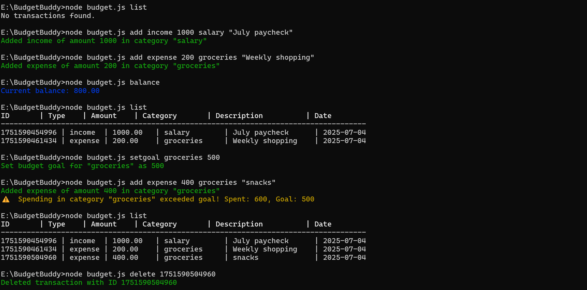
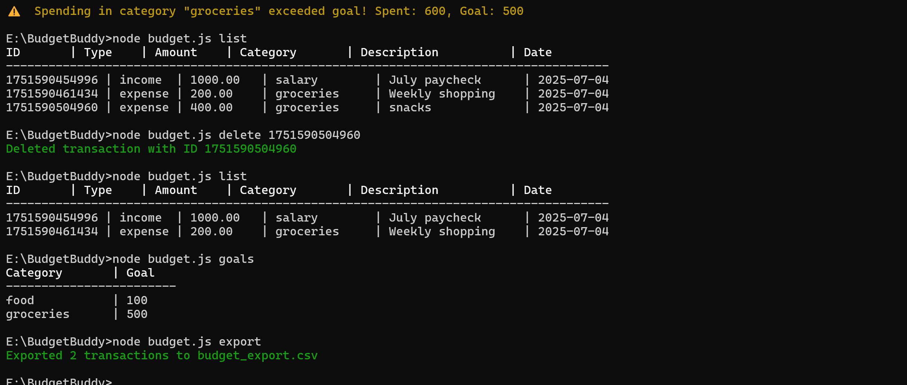

# BudgetBuddy

A simple and user-friendly CLI-based budget tracker built with Node.js to help you manage your income, expenses, and budget goals efficiently.

## Features

- Add and delete income and expenses with categories and descriptions  
- View current balance and transaction history  
- Set budget goals and receive alerts when overspending  
- Export your transactions to CSV for easy analysis  
- Stores data locally using JSON files  

## Installation

1. Clone the repo:  
2. install dependencies
3. Run the app with node : node budget.js <command> [options]

//Example commands
node budget.js add income 1000 salary "July paycheck"
node budget.js add expense 200 groceries "Weekly shopping"
node budget.js balance
node budget.js list
node budget.js setgoal groceries 500
node budget.js setgoal total 2000
node budget.js add expense 400 groceries "Bonus snacks"
node budget.js export
node budget.js delete 1723000000000
node budget.js goals

//order
type, amount, category, description
node budget.js (add) (income/expense) (money) (category (food/travel etc...)) (description optional)
//let me follow the above commands and show the example

## Screenshot
1)

2)

